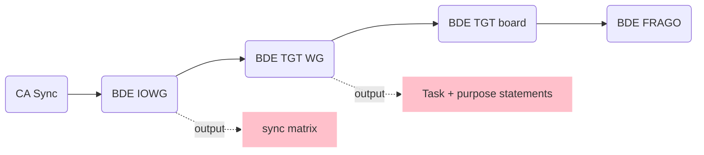

**NTC Notes**  
Daniel Torkelson

# By Date
## 4 Feb 2019
**In the box**: immediately integrate into the TOC/S3/S7/S9, nonlethal targeting cycles, and attend Inform and Influence Working Group
### Individual MILES handout
* everyone needs: batteries, zip ties, 550, tape
* a good **halo** has:
  * hooks and ladder locks on both sides
* a good **harness** has: 
  * a button and buckle on control unit
  * buckles and ladder locks on all 4 straps
  * working control unit
* a good **M4 attachment** has:
  * both bolts screw in
* attaching harness needs at least 4 large zip ties
* attaching halo needs 4 small pieces of 550 (stripped)

## 8 Feb 2019 - wish list
* separate bug-out bag
* two canteens or 1 canteen + camelbak
* MOLLE pouch for NVGs
* long bungees in the MMWV cab to tie down gear
  * small ratchet straps for MRE box & water
* talk boxes/speaker for ASIP radio is **necessary**
* \*Every\* truck needs a water can (at least one)
* hurting for 550 (as usual), bungees
* had power via CMOC when stopped, but in a convoy solar panels would have been good
* gunner's step-box: also good storage? 
* closed/sealed thermos (i.e. Yeti)
* truck radios: ensure antennae are plugged in, in the back
* need a back rest / lower back cushion when the TC (fleece or ECWCS works)
* mint gum to clear stuffy nose
* gum or sunflower seeds (and spit cup or bottle) to stay awake during long convoys

## 13 Feb 2019 - BDE Staff AAR
> "Figure out how to plan in your truck [after the tent goes down]."  
* TOC comms equipment: FM, HF, TACSAT, JCR/JBCP, JCRLOG, CPP-WIP, HCLOS, CPOF
* A CAR **describes** so that subordinates can **visualize**
* the TAC: 
  1. an alternate mission command cell
  2. jumps forward
  3. takes the fight during reorganization/reconsolidation
  4. a planning cell for air assault operations
* plan and rehearse your jumps, notify subordinate units
* [me, aside] _the planning and mission command of Razish reminds me of the book I read at CCC on Fallujah I think_
> "The staff running estimate is your two minute drill, your CUB, your BUB, your shift change... it has a **huge** effect."

# By Topic
## Capabilities Elevator Pitch
### Diplomatic
* Strengthen partnerships
* Develop, manage, and enhance programs to mitigate civil vulnerabilities IOT reduce the influence of VEOs
* Leverages DoD funding pools/resources to connect populations to their government

### Military
* Use nonlethal methods to accomplish theater objectives
* Identify, target, and mitigate drivers of instability to reduce VEOs
* Map human terrain & illuminate networks through enduring programs, rapid reporting, and persistent engagements
* Deepen partnerships with local governments, HN forces, IGOs/NGOs by sharing resources

## Getting out of the unit
* fit _individuals_ first...
  * issue weapons/NVGs: this must have taken 1.5-2hrs, with people just trickling in
  * issue vests, plates, mags
    * these two above should also be done repeat-after-me style to ensure everyone has one that works and they know what they're getting
  * ...then let them load it in the VICs
    * do PCC/PCI here at this point (down to the basics: water, weather, uniform, working condition for just-issued items)
    * ensures that individuals are not pushing personal gear to the Company transportation (yet, at least)
  * ...then collective equipment and tasks
    * everyone pitches in to:
      1. move equipment from a STAGING area --> outside
      2. lift into LMTV
      3. pack **according to a load plan**
      4. as equipment is loaded, check it off the list
* backwards plan from convoy brief time
  * time between end of convoy brief and SP is for comms check, staging, and latrine... NOT for packing or PMCSing

## Previous rotation AAR
* sync meetings daily
* IRC sync matrix
* task & purpose in mission orders
  * include triggers for CATs to perform their tasks
  * CATs \*probably never\* operate independently
  * purpose **always** ties into higher's tasks (i.e. higher's task becomes lower's purpose)
* CMOC organization, utilize all people
* COP: needs unit boundaries, BN/BDE overlay
* assessment and collection requirements
* team rehearsals
* digital PACE plan
  * BNs have upper TI backbone to pass info
  * this is distinct from your voice PACE plan
* single COP between CA and PSYOP

What are we doing to help in the deep/close/support zones?

## Simplified battle rhythm

## Orders production
> ~~Does the CMOC push orders down to CATs directly?~~ 

no 
> Or do CATs get their mission from supported BN as a subordinate unit of theirs?  

yes, this. The CMOC's inputs to the BDE orders process get reflected in FRAGOs, which go to the BNs, which trickle down to the CATs.

## Planning
| Team actions | Timeline | BDE actions |
|-------------:|:--------:|-------------|
|              |Next 96   |Guidance     |
|              |Next 72   |Proposing    |
|Plan          |Next 48   |Validating   |
|Rehearse      |Next 24   |Refinement   |
|Executing     |Current 24|Monitor      |
|Assess/Report |Last 24   |Assess       |

## TOC Functions
1. receive information
2. distribute information
3. analyze information
4. recommend to CDR
5. integrate resources
6. synchronize resources

## Misc. advice
* provide sync matrix and push to teams **every day**
  * go into the targeting meeting with this sync matrix
* HF - best thing to talk on
* "Align teams utilizing FRAGOs. It assigns them to a BN"

## Commo / CMOC notes
### JCR (Joint Capabilities Release)
* docking station is bad, prevents DAGR from connecting
* to manually enter the role names for msg, must create user group
* write up status reports, save as, then create quick msg
* software version was BEHIND other units!
  * get it imaged and **upgrade**
  * ensure that they give it the right role name
* choose role name at startup **after** entering password but before clicking
* set cyclic status updates to push, and teach the teams

### Misc commo
* NIPR laptops: **NEED** username + password sign-on, _not_ CAC only
  * also need a "dirty" computer to plug in our devices like cameras or phones or USB sticks (that is, if products are being created on personal computers and need to get to a government computer via cd)
* SIPR accounts need to be created much sooner, and there's paperwork to go along with it
* Get using the MDL at the unit before caoming out IOT transfer docs from SIPR to JCR. Figure out file conversions and extensions (get OpenOffice on the SIPR machines?)
* know the data transfer rates and common file sizes of OPORDs and CONOPs
* keep NIPR and SIPR lines on a reel, three of them stapled together. That way, we roll it out to the BDE S-6 and plug in both at the same time, and have a backup line(s) in case one goes bad.

### CMOC frequent needs
* 550
* zip ties
* trash bags w/ cardboard box (to hold it up/weigh it down)
* **SUPERFINE MAP MARKERS**
* **ACETONE/NAIL POLISH REMOVER**
  * paper towls or rags (rags preferred)
* highlighters
* pens
* dry-erase markers
* tape
* key tags/identifiers, and a log to sign them out
  * or just keep a hand receipt that's exchanged with the key

### CMOC future ideas
* mount long power strips to bottom of tables
* some short extension cords (to reach ceiling lights)
* small plastic boxes to organize the contico box
* CIM tools
  * ORA - social network analysis
  * QGIS
* both Verizon and AT&T hotspots (redundancy)
* wall calendar w/ SIGACTS (IDP movements, meetings, major combat actions on acetate overlay)
* bring an extra batter for main generator (in this case, it was the 5K but the DRASH environment generator is apparently 5x better)
* the analog products/tracking must mirror the digital ones in that they continue the same work with no continuity issues (albeit at a slower pace). They should **not** be fundamentally useless when we don't have power or network (which was generally the case)
* magnetic COP board/map
* COMMO CARD from BDE!! Internal as well
  * need _real_ callsigns for people, not VICs
* velcro, velcro, velcro: stick things to the walls, like the ISS
* wireless signal extender/antenna (sustain)
* "Captain's log" of every grid the CMOC occupies, how long they're there for, and significant events that happened (may be accomplished by the aforementioned calendar)

## The COP (Common Operating Picture)
### Base Elements:  
* BDE graphics
  * friendly BNs, logistics points
* front line trace
* phase lines
* BN boundaries
* ENY situation
### CA layer
* CATs
* current assessments - push to teams
* guess at where DCs will move based on ENY situation
* key infrastructure
* population stats, town status (turned over, secured, in contention, enemy-held)

## Feeding the CA COP & Running Estimate
### Inputs
* CATs: assessments, KLEs, CR
* NGOs: regular sync, meetings/calls
* Military: CUB/BUB, S-2, HUMINT
* HN: KLEs the CMOC does, CLT

### Outputs
* Baseball cards
* updated town studies
* answered RFIs
* new work projects
* input to IOWG
* CUB or BUB brief
* requests for aid
* tasks to CATs/CLT

## The IOWG (Information Operations Working Group)
_also known as the Non-Lethal Working Group (NLWG)_ 

Minimum inputs: assessments (last 24), running estimate, sync matrix

1. Roll call
2. Running estimate, each participant 
3. Sync matrix
4. SITREPs from yesterday
5. Assessments
    * by each participant
6. Plans (sync matrix)
    * by each participant
7. Next 48
    * by each participant
8. Next 72
    * by each participant
9. Next 96
    * by each participant

## The CA SITREP
* send every day at 2000 (or some specified time)
  * TO: BDE CDR, S-3, XO by email
  * possibly CC the country team
* Ask BDE about their running estimate format
  * possibly in `5-0`?
  * current tasks and status, for all towns we've encountered
  * location/task/purpose for each team
  * stats on DCs (last 24 and total) by ethnicity
  * NGOs that could provide help
  * implied tasks, resources

## Mid-Rotation CMOC AAR
* SI checks more often, prior to every move
* Training priorities, SOPs--where do they stand? 
  * implied: rehearsals, setup/tear down
  * get our reporting formats and TACSOPs from our (home) CA BN
* Duties and job descriptions for each person, not just titles for them
  * who breaks down the BDE FRAGOs?
* Idea: Gov/UNCLASS hard drive w/ router and 4 LAN cables for a mutual access storage center (a local share drive between our 3-4 laptops)
* [me, on the exclusion of NCOs from the CMOC work] _There was no rhythm for the NCOs to come in and observe though; almost everything was ad-hoc and unplanned, requiring my full attention to 1) initiate, 2) dlegate, and 3) supervise & refine_
  * If I could sit them down at a task and trust that they were be enabled to do it (given a task/purpose/conditions/standards, an SOP to follow, and only occasional supervision), then I might have. But I was _creating_ those things for the first time, myself.
* Fillable, laminated reporting formats: requires more than just thinking up the words! It take sformatting, printing, cutting, laminating, the right kind of markers, erasing solution, and rings to hold them all together
* CBRNE rehearsals, battle drills (needed more of it, could have done it)
* [me, on giving our Soldiers the 'basic training treatment']: 

| Cons       | Pros                     |
| ---------- | ------------------------ |
| takes time | fewer losses             | 
| demeaning  | leaders leading          | 
|            | greater domain knowledge |
|            | squared away             | 
|            | better PCC/PCI           |
* I could write a script to read my SITREP files into a spreadsheet
  * could work on a town study too, with fields for population, mayor, services, etc.
* We need a permanent LNO at BDE
* Problem: our knowledge of how we get support from BDE
  * trucks: TM SGT needs to get with the mechanic
  * supplies: get w/ BN S-4
  * comms: get w/ BN S-6
  * medical: where is Role 1? Role 2?
  * **Don't wait until you need it!**
* Top 3 priorities: 
  1. Reports + SOPs
  2. Commo equipment
  3. PMCS on everything

---
# Personal reminders
> Hard to balance what to keep on person (in assault pack)[^1] vs. storing in duffel and still maintain readiness the entire day. If I don't get access to my duffel at all, how do I cope with the transition from day to night and warm to cold? 
> Or from night to sleeping to morning?
> * swap sunglasses to clear lenses
> * fleece, cold weather jacket, beanie
> * hygiene: teeth, eyes, face, shaving (morning), deodorant
> * changing out socks & underwear
> * add/put away NVGs
> * [sleeping] access to either woobie or sleeping bag

[^1]: But at the same time, my assault pack has always been (and still should be) for mission-related things: notebook, references, tech, charger, and then also food+water. Buf if I found a way to fit toiletries, warm weather jacket, glasses, woobie, pnocho, and ONE type of snack, plus a notebook+battery, I might solve my issue. That, plus an external sleeping bag should be good as a go-bag for KIA.
* NEED: closed-lid thermos (Hydroflask, Yeti, Camelbak)...jet boil cup not enough, and only useful if you're jet-boiling
* better pens, and more of them (and pencils!)
* **NVG pouch**
* modify BEB TACSOP and TOCSOP for CA (with input from CA TACSOP)
* create better storyboard format
* on coldest nights (and sleeping/staying in the truck), I wore silks top, t-shirt, OCP blouse, fleece, lvl 5 with beanie. Also wrapped up in woobie
  > `Transcribing note:` I assume, since I didn't leave any negative impression, that this was sufficient 

* On most occasions, to handle the cold, I added the lvl 5 to my OCPs and maybe the fleece cap. This was often in the CMOC
About 3 days into the box, I created a "hygiene-lite" kit that could fit in my assault pack and cover the basic needs: toothbrush, mouthwash, rinseless soap+shampoo, deodorant, electric razor, and meds
  * also a part of this move was to put my snivel gear (shemagh, cap, woobie, fleece) in the large stuff sack to keep it in my assault pack. Now, all I needed to bed down was the pack and my sleep system (bivy + cold weather bag w/ pillow case), and my sleeping pad separately.
Useless things that ended up in my assault pack by day 5: an MBITR, a TACSOP (ok maybe not "useless"), a Warrior Skills LVL 1, and kindle (never had time to myself to read)
* I'd also keep my flashlight, alarm clock, USB battery, phone, and camera cables in there, and occasionally stash NVGs in it. 
  * water and eye pro were attached to the outside
* The most frequent reasons to go back into my duffel, and by extension the truck, were: 
  * get or return sleeping bag (loose in truck) and sleeping pad
  * jet boil coffee mug
  * new socks or underwear
  * foot spray (until I started keeping it on the outside of my assault pack)
  * misc. item retrieval: fork/spoon tool, bandaids, extra hygiene items, Clif bars
  * [truck itself] use the mirror for shaving
* pre-printed name labels for gear
* the more water and fuel cans you can take (in the truck, in a trailer) the better off you are... and resupply isn't guaranteed to be on time or exist at all
  * same principle applies to personal supply of water-- 1 x 1-qt canteen won't cut it
* worth trying the "CAT 2 sleeping variations" wherein they would sleep one on the hood of the HMMWV between the windshield and the airlift hooks, and one on the back against the tire (with 2 duffels pushed into the creavice)

### Things I don't need in the box
* PTs
* shower towel
* ditty bag (don't do traditional shaving in the desert)
* extra uniform (debatable)
